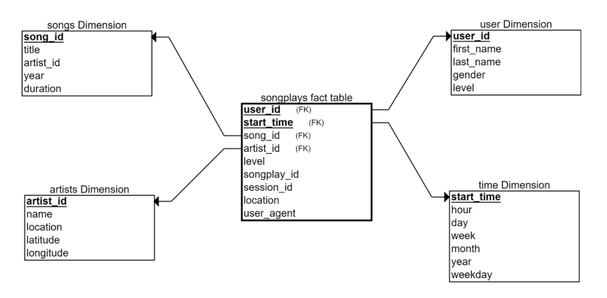

# Datapipelines with Apache Airflow

## Project Description
A music streaming company, Sparkify, has decided that it is time to introduce more automation and monitoring to their data warehouse ETL pipelines and come to the conclusion that the best tool to achieve this is Apache Airflow.
This project builds a high grade data pipeline that are dynamic and built from reusable tasks, can be monitored, and allow easy backfills. It also has data quality that plays a big part when analyses are executed on top the data warehouse and want to run tests against their datasets after the ETL steps have been executed to catch any discrepancies in the datasets.

The source data resides in S3 and needs to be processed in Sparkify's data warehouse in Amazon Redshift. The source datasets consist of JSON logs that tell about user activity in the application and JSON metadata about the songs the users listen to.

This will allow the analytics team to continue finding insights into their data.

## Project Datasets
Song Dataset and Log Datasets are available in S3 bucket

Song Dataset - `s3://udacity-dend/song_data`

Log Data - `s3://udacity-dend/log_data`

Both these datasets are in the jSON format.

Song Dataset - Is a subset of real data from the Million Song Dataset. Each file contains metadata about song and the artist for that song. The files are partitionefd by the first 3 letters of each song's track ID. For example, here are 2 filepaths to 2 files in this dataset

song_data/A/B/C/TRABCEI128F424C983.json
song_data/A/A/B/TRAABJL12903CDCF1A.json

Sample data from the song dataset

```
{"num_songs": 1, "artist_id": "ARJIE2Y1187B994AB7", "artist_latitude": null, "artist_longitude": null, "artist_location": "", "artist_name": "Line Renaud", "song_id": "SOUPIRU12A6D4FA1E1", "title": "Der Kleine Dompfaff", "duration": 152.92036, "year": 0}
```

Log Dataset - These are log files in JSON format generated by an event simulator based on the songs in the song dataset. These simulate app activity logs from the sparkify music streaming app based on configuration settings.

The log files in the dataset are partitioned by year and month. For example, here are 2 filepaths to 2 files in this dataset.

log_data/2018/11/2018-11-12-events.json 

log_data/2018/11/2018-11-13-events.json

Sample data from this file
    


## Tables Created
|  Name | Type  | Description  | Columns  |  Partition Columns|  
|-------|-------|--------------|----------|------------------|
| users |  dimension table |users in the app   |  user_id,first_name,last_name,gender,level ||   
| songs |  dimension table |songs in the music database    | song_id, title, artist_id, year,duration | year, artist|  
| artists  | dimension table  | artists in the music database  | artist_id, name, location, latitude, longitude  ||   
| time |  dimension table |timestamps   |  start_time, hour, day, week, month, year, weekday |  year,month|
| songplay |  fact table | records in log data associated withj song plays i.e records with page `NextSong`  |  songplay_id,start_time,user_id,level,song_id,artist_id,session_id,location,user_agent| year,month|

## Star Schema 


### Steps
1. Extract and Load (EL) data from JSON files stored on Amazon S3 into staging tables on AWS Redshift. No transformations are made in this step.
2. Extract, transform and load the data from staging tables into fact tables and dimension tables in AWS Redshift.
3. Data Quality checks are performed on the dimensional tables to see if the transformations ran correctly.

### DAG showing the sequence of steps


### Key files used in the project
1. airflow/dags/udac_example_dag.py - Defines the tasks and arranges them in the DAG
2. airflow/plugins/operators/stage_redshift.py - Loads data from S3 to Redshift using Redshift's `COPY` command
3. airflow/plugins/operators/data_quality.py - Defines the data quality operator that checks if all tables are populated correctly
4. airflow/plugins/operators/load_dimension.py - Defines the operator that loads data from the staging table to dimension tables
5. airflow/plugins/operators/load_fact.py - Defines the operator that loads data from the staging table to the fact table.
6. airflow/dags/drop_and_create_table.py - Defines the task in the DAG that calls the SQL scripts to drop and create the tables in Redshift.
7. airflow/plugins/helpers/sql_queries.py - Contains the INSERT queries that transforms the data from staging into the fact and dimension tables.

### Summary
This project demonstrates how we can build a data pipeline using Apache Airflow.